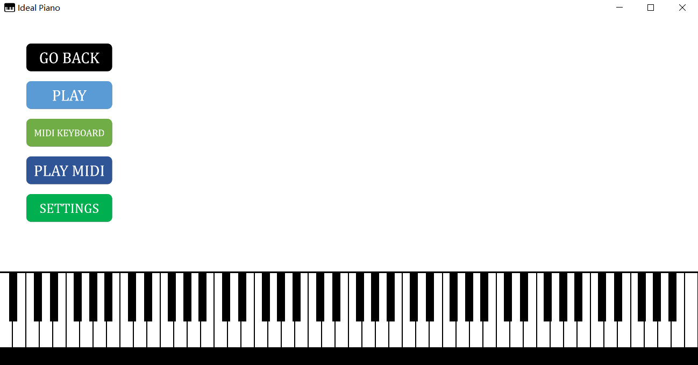
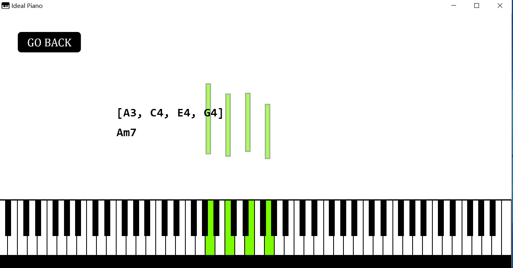
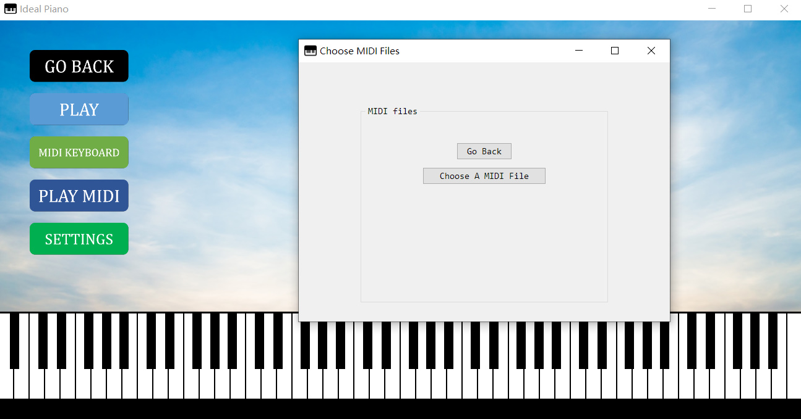
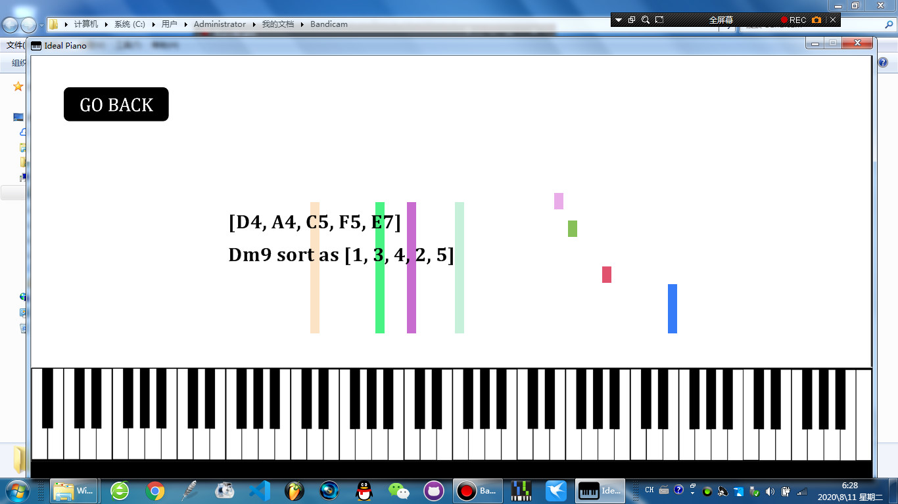
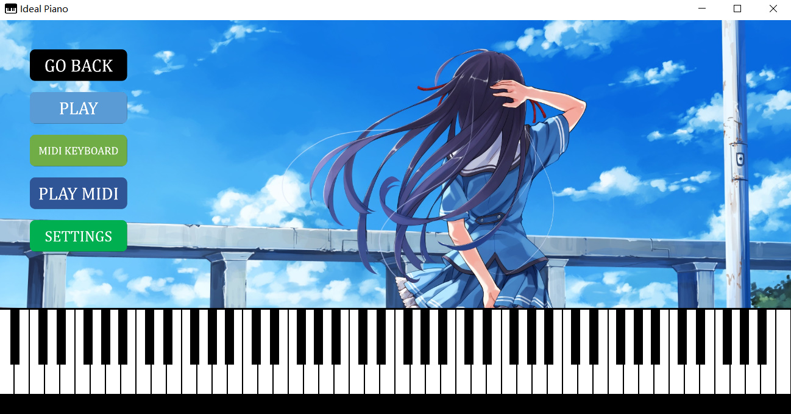

# Ideal-Piano

[中文](https://github.com/Rainbow-Dreamer/Ideal-Piano/blob/master/README_cn.md)

## Introduction

This is a smart piano software that I started to develop in April 2020.

The best feature of Ideal Piano is that it uses algorithm based on music theory to determine what chord types you are currently playing and displays it on the screen. This algorithm comes from my another project [musicpy](https://github.com/Rainbow-Dreamer/musicpy), a python library to compose and analyze music, if you are interested in it, please check it. This algorithm could detect all root position chords, chord inversions, voicings and chords which have altered notes, omissions, from simple chords to very complex chords.


## Functionality

* You can use your computer keyboard or MIDI keyboard to play, keyboard mappings with notes could be customized in the settings file
* Analyze what chord types you are playing in details and display on the screen
* Choose MIDI files to playback in waterfall form, show current chord types in real time, you can also choose to display detailed music theory information for the current chord
* Support playing MIDI files with multiple tracks, change playback position by clicking on the progression bar when playing
* You can choose to split the melody and chord parts of MIDI files and play only one of them, using music analysis algorithm based on music theory
* You can choose to analyze current key you are playing or MIDI files in real time using music analysis algorithm based on music theory, supporting major, minor and church modes like dorian, lydian (experimental)
* Load audio files or SoundFont files as instruments
* Connect with DAW and analyze chord types that is currently playing in the DAW
* Fully customizable UI, easily change background image, font type, font size, customize piano keyboard, etc.
* You can choose to display corresponding note names on piano keys (by default the note names are not displayed on the piano keys)


## Cross-platform

Ideal Piano currently supports Windows, Linux and macOS. Please see the download section of README.

Windows: tested on Windows 7, 10, 11

Linux: tested on Ubuntu 21.10

macOS: tested on macOS 12


## Usage

Please check user instructions in `User Manuals` folder, which provides detailed instructions of how to use each functionality of Ideal Piano. The settings manual in the  same folder is also worth checking, as it describes what each setting parameter in the settings file is, so you can customize Ideal Piano through modifying setting parameters.


## Download

You can download this software for Windows, Linux and macOS from [here](https://www.jianguoyun.com/p/Daurwu0QhPG0CBjxt8QEIAA).

Note1: for Linux version, playing MIDI files using default settings requires installing freepats and timidity. Then follow the steps in User Instruction. On Ubuntu you can run

```
sudo apt-get install freepats timidity
```

If you want to use SoundFont files as instruments in the Linux version, you need to install fluidsynth, you can refer to [here](https://github.com/FluidSynth/fluidsynth/wiki/Download) for the install command for different Linux distributions. For Ubuntu, it is

```
sudo apt-get install fluidsynth
```

Note2: for macOS version, If you want to use SoundFont files as instruments, you need to install fluidsynth, you can use homebrew to install fluidsynth by running this line in the terminal

```
brew install fluidsynth
```


## Previews

Here is a preview of Ideal Piano:



<p align="center">the initial screen of Ideal Piano</p



<p align="center">Display notes you are current playing, analyze the chord types and display on the screen</p



<p align="center">Window for selecting MIDI files to play</p



<p align="center">Playing MIDI files with multiple tracks</p



<p align="center">You can simply drag an image file to the screen to change the background</p>


## Building from source

If you cannot run the executables on your current system, the best solution is to build from source code.

Take Linux as an example, the executable build from Ubuntu 21.10 may not work on Ubuntu 22.04 due to some core libraries differences and other incompatible issues with newer versions.

For information on how to build Ideal Piano from source, please check user instructions in `User Manuals` folder.


## Other notes

Currently supported languages only include English and Chinese, you can change the language by change the setting parameter `language`.


## Donation

This project is developed by Rainbow Dreamer on his spare time to create a smart piano software. If you feel this project is useful to you and want to support it and it's future development, please consider buy me a coffee, I appreciate any amount.

[](https://www.paypal.com/donate/?business=7XSUZCQNT4M4Y&no_recurring=0&currency_code=CAD)


## Summary

If you encounter any problems when using this software, please take a look at the user manual first, if you cannot solve the problem, you can contact me by sending emails to 2180502841@qq.com, thank you for your support~

