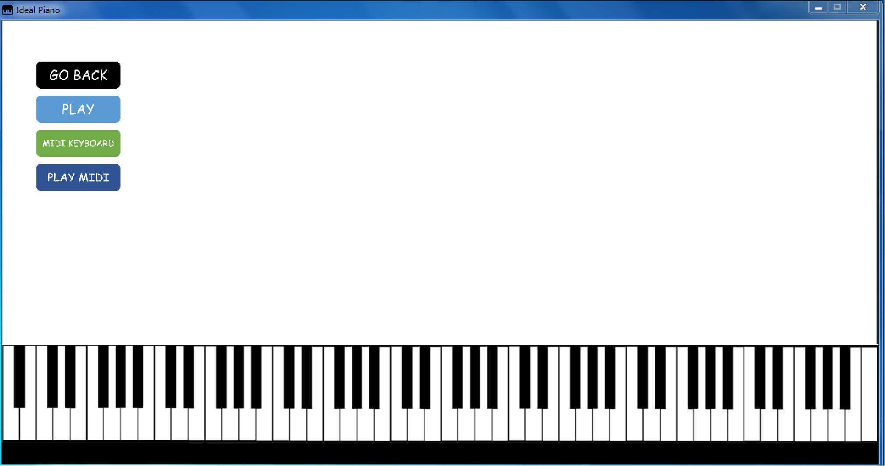
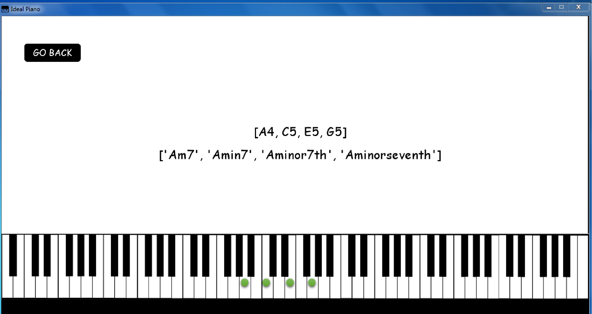
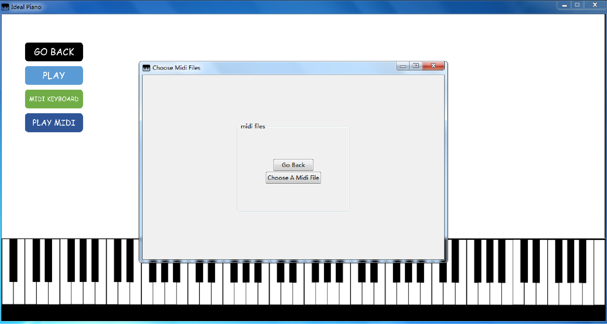

# Ideal-Piano
這是一款智能鋼琴軟件，我在2020年的4月份開始開发，最近8月初接近完工。這款智能鋼琴軟件對於音樂初學者，音樂人，音樂愛好者等都有一些用處。
Ideal Piano最大的特色就是通過樂理邏輯的算法來判斷當前演奏的音組成的是什麽和弦，並且顯示在屏幕上。這個算法是自己的一個項目，
樂理作曲語言庫musicpy里面自己精心設計的一個樂理邏輯算法，判斷的效果非常好，包括所有的原位和弦，各種和弦的轉位，voicings
和變化音，省略音等等，可以判斷非常覆雜的和弦組成，並且有多個樂理邏輯判斷優先級的參數可以調整。（默認的參數設置的適用性最廣泛）

這個智能鋼琴軟件總共有三個模式，電腦鍵盤自由演奏，midi鍵盤自由演奏和播放midi文件分析和弦並且實時演示。
在播放midi文件演示的模式中，可以選擇通過算法去除主旋律，只聽低音部分的和弦的音符。
這三個模式在打開Ideal Piano之後選擇左上角對應的按鈕就可以進入。

第一個模式，電腦鍵盤自由演奏，默認的鍵位在config.py這個文件里，如果想要改變鍵盤對應的音符，直接在config.py里改然後保存即可。
這個模式主要提供給沒有任何midi鍵盤的小夥伴平時可以彈著玩（沒錯就是這麽無聊www）

第二個模式，midi鍵盤自由演奏，接上midi鍵盤到電腦，然後進入這個模式，就可以在midi鍵盤上演奏，並且軟件里同時會顯示你當前彈的音在對應的鋼琴的位置，
同時實時分析你當前彈下的音組成的是什麽和弦（根音加上和弦類型的完整表述），並且顯示在屏幕上。音源可以自己在config.py里設置路徑和音源的文件類型
（wav, mp3, ogg等等）。之前我想實現同時DAW（編曲宿主）和Ideal Piano共用一個midi鍵盤，或者DAW里面播放工程同時Ideal Piano也可以顯示當前的音符，
可是在一開始遭遇了失敗，一直都是顯示Host error之類的錯誤，後來我找到了很好的解決辦法。loopMIDI這個免費軟件可以做到建立虛擬midi端口，
因此可以用來連接多個不同的軟件的midi端口。使用loopMIDI可以讓DAW和Ideal Piano同時使用一個midi鍵盤，這樣你就可以在DAW里面加載自己想聽的音源，
然後在midi鍵盤上演奏，聽到的是DAW的音源，與此同時Ideal Piano也可以同步地實時顯示當前演奏的和弦類型和音符。除此之外，也可以實現在DAW里播放工程，
同時Ideal Piano也可以顯示當下演奏的和弦類型和音符。具體的操作流程我在“請先看我!.txt”里面寫的很詳細，請大家去看看。

第三個模式，播放midi文件實時分析當前的和弦，進入這個模式後，會彈出一個文件瀏覽框讓大家選擇想要在Ideal Piano里播放的midi文件，選擇完成之後，
可以選擇自己想要播放的midi軌道，選擇播放的範圍（按照百分比來算，比如播放前半段就可以輸入在範圍那邊寫0和50），也可以選擇播放的BPM（曲速）。
也可以選擇通過算法去除主旋律，只聽低音部分的和弦的音符。（這個去除曲子的主旋律的算法是我自己想的，經過實測，對於大部分曲子的效果還是不錯的）
在這個模式下，選擇的midi文件會在Ideal Piano里播放，聲音來自於自己設置好的音源（音源必須是一個文件夾里面是以音符為名字的音樂文件，比如C5.wav這種），
在畫面上會顯示當前的音符在鋼琴上的位置，並且實時分析當前演奏的音符組成的和弦。如果不想要聲音來自於設置好的音源，想要來自DAW的音源的話，
使用loopMIDI就可以做到了，在DAW里播放工程，同時Ideal Piano可以同步接收到midi信號，實時分析當前的音符組成的和弦，顯示音符與和弦類型在屏幕上。
具體的操作流程請到"請先看我!.txt"這個文件里看。

由於這個項目完全由本人一個人完成，本人的美工水平欠佳，因此只要不是對於美工很挑剔的話，Ideal Piano還是可以用的很順暢的qwq
以下是Ideal Piano的畫面預覽：

打開Ideal Piano的初始頁面

演奏時顯示音符並且實時通過樂理邏輯分析判斷當前演奏的音組成的和弦類型

選擇midi文件播放的窗口

(這個是用電腦鍵盤上的的printscreen按鍵截屏的，並且放到ppt里裁剪了一下，圖片質量受損很嚴重，所以看起來很模糊，請大家諒解qwq)

